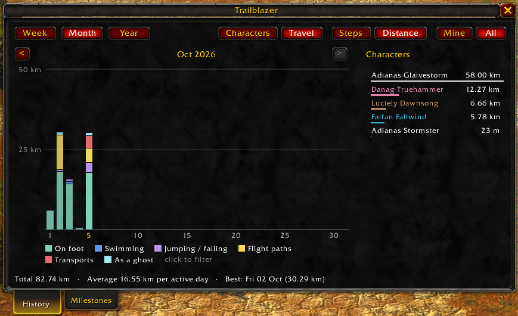
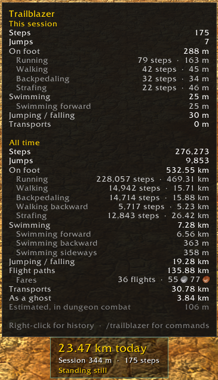
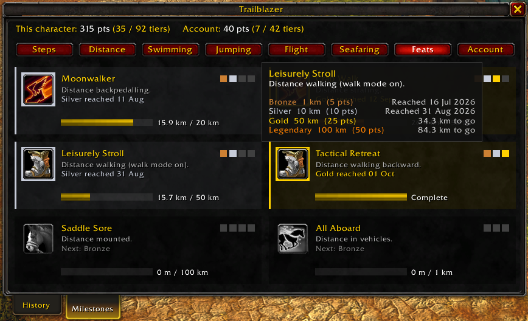

# Trailblazer

A World of Warcraft addon for **WoW Forever** that counts the footsteps your character takes and how far you travel by every other means.

## Features

- **Step counting** from your actual movement, using stride lengths measured for every Forever race and sex. Running, walking, backpedaling and strafing are tracked separately.
- **Distance by travel mode:** on foot, mounted, shapeshifted (druid forms, Ghost Wolf), swimming, jumping and falling, flight paths (with the fares you paid), boats, zeppelins and trams, and corpse runs as a ghost.
- **A small panel** with today's steps, the session so far and what you're doing. Hover it for the full breakdown.
- **History:** week, month and year charts of steps or distance for one character or all of them, stacked by character (in class colours) or by travel mode, with a filterable legend.
- **Milestones:** travel achievements in Bronze, Silver, Gold and Legendary tiers, with points, per character and account-wide.
- **Stride calibration:** measure your own stride lengths if the built-in ones don't suit your character.

## Screenshots

  
  

## Download

You can download Trailblazer from these popular sources:

* [Wago Addons](https://addons.wago.io/addons/trailblazer)
* [CurseForge](https://www.curseforge.com/wow/addons/trailblazer)

## Commands

`/trailblazer` or `/trail`, followed by:

| Command | What it does |
| --- | --- |
| *(nothing)* or `help` | List the commands |
| `history` | Open the History tab |
| `milestones` | Open the Milestones tab |
| `stats` | Print today's, the session's and all-time totals |
| `options` | Open the options page |
| `show`, `hide` | Show or hide the panel |
| `lock`, `unlock` | Lock or unlock the panel's position |
| `units metric` / `units imperial` | Switch between km and m, or miles and feet (`km` / `mi` work too) |
| `calibrate` | Open the stride calibration window |
| `reset` | Reset the session totals (`reset all` erases this character's history) |

Right-click the panel to open the history. Trailblazer is also in the addons menu on the minimap: left-click for the history, right-click for milestones.

### Diagnostics

For checking what the addon sees, mostly useful when reporting a problem:

| Command | What it does |
| --- | --- |
| `debug` | Toggle a live readout on the panel: position source, travel mode, gait, speed and stride |
| `strides` | Print the stride lengths in use for this character, and where each comes from |
| `perf` | Print the addon's memory and CPU use, and how much memory it uses up while you move |
| `whoami` | Print how the game identifies this character: name, GUID, realm and game mode |

## How counting works

Trailblazer samples your position a few times a second while you move, and sleeps while you stand still. On foot, distance is divided by your stride to get steps; other modes record distance only. Inside dungeons, where positions are hidden, it falls back to your movement speed, and during dungeon combat to an estimate, which the tooltip shows separately.

All data is saved per account in `TrailblazerDB`, with each character keyed by its GUID.
